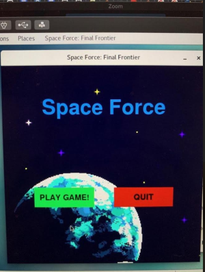
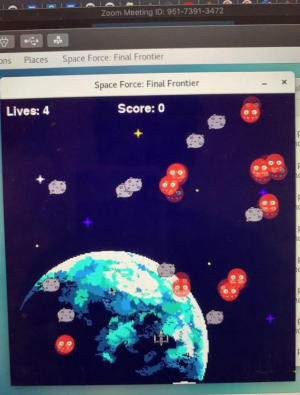
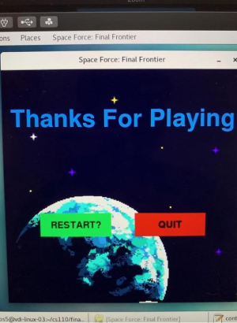
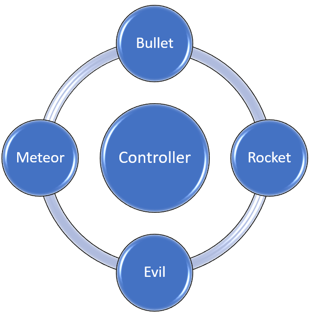

# Mohr's CIRCLE
## CS 110 Final Project
### Spring, 2020
### [Assignment Description](https://drive.google.com/open?id=1HLIk-539N9KiAAG1224NWpFyEl4RsPVBwtBZ9KbjicE)

https://github.com/bucs110/final-project-spring20-mohr-s-circle.git

### Team: Mohr's Circle
#### Raafiul Hossian, Samuel Pun, Reymundo Ramos

***

## Project Description
A space invaders game with rockets, bullets and meteors in MVC structure.

***    

## User Interface Design
* 
    * **Start Page** *Has a Play Game Button which leads to the Game Screen and a Quit Button that exits the program.*
* 
    * **Game Page** *Main Page of our GUI, where the Controller's events processing is held and the User interats with the program*
* 
    * **End Page** *Has a Restart button which loobs back into the Game Page and a Quit Button that exits the program.*

***        

## Program Design
* Non-Standard libraries
    * Time Modulo
        * https://docs.python.org/3/library/time.html
        * A chronological counter of how long the user has been playing the game
* Class Interface Design

     
     
* Classes
  - **Controller:** *Direct point of contact from our game to the user. Sets up events and creates reactionary updates. Contains                              Main-Loop, Intro-Loop, Game-loop, and Exit-Loop.*
  - **Evil:** *Enemy class that user must defeat to win. Contains instance variables such as image, rect,speed and ID. Also contains                    update method.*
  - **Bullet:** *Contains Image,rect speed and direction as instance variables. Also contains update as its only method.*
  - **Rocket:** *Primary class handled by user. Contains image,rect,speed and health as instance variables. Contains damage, move                        release and and update as its methods.*
  - **Meteor:** *Foreign object responsible for reseting user's position. Contains image rect and ID as instance variables. Also                          contains update as its method.* 

***

## Tasks and Responsibilities

### Software Lead - Raafiul Hossain

Worked as integrations specialist by making sure the home page and the game page interacted fluidely. Helped with rocket/bullet collision mechanism, and making sure daily/weekly zoom meetings were held to keep everyone on same pace. Completed READ.md.
 
### Front End Specialist - Reymundo Ramos

Help work on implementing models made by back end into the controller. Also helped work on the collisions in game as well as implementing GUI attributes: score, number of lives left, backgrounds.

### Back End Specialist - Samuel Pun

Wrote all of the data classes that represent state and behaviour. Helped get the GUI started and incorporated an intro screen by creating and implementing a state called intro. Worked on bullets shooting out of the rocket. Created and worked on the bullet/evil collisions. 

 
## Testing
*Below are a few criterias we used to measure the success rate of our project* 

| Step | Procedure | Expected Results | Actual Results |
| ---- | --------- | ---------------- | -------------- |
| 1 | Press Start on Front Screen | GUI window for Game Screen Appears | GUI Window for game Screen Appears |
| 2 | Press Quit on Fronst Screen | Exits game, returns back to terminal | Returns to terminal |
| 3 | Click Spacebar not at enemy | Bullet does not hit target, disappears on border | Bullet disappears from Screen |
| 4 | Click Spacebar at enemy | Bullet hits enemy, evil disappears | Bullet hits enemy, evil disappears |
| 5 | Collide with Meteor | Rocket loses health | Rocket resets to starting position |
| 6 | Collide with Enemy | Rocket resets to a different position, looses health | Resets, and looses health |
| 7 | User's health goes to zero | Game loop ends: End screen opens | End Screen Opens wth option to restart game |
| 8 | User does nothing | Rocket experiences collisions until health is zero | End Screen Opens wth option to restart game |
| 9 | User decides to restart game | Game loop restarts | Restart game loop |
| 10 | User decides to quit game | Exits game, returns back to terminal | Returns to terminal |

